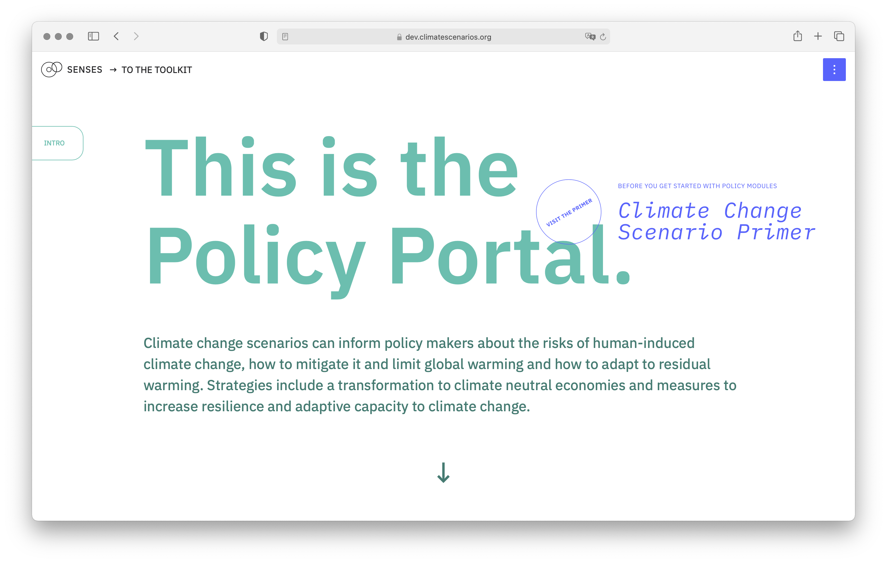

# Policy Portal
This repository contains the code for [*Policy Portal*](https://dev.climatescenarios.org/policy-portal/), where sectorial transition and electrification is unpacked. It is part of the [SENSES Toolkit](https://climatescenarios.org/).



## License

The source code is licensed under the [ISC license](LICENSE.md). Text and graphics are licensed under [Attribution-ShareAlike 4.0 International](https://creativecommons.org/licenses/by-sa/4.0/). For licensing information on datasets please refer to the data sources section. Exceptions are listed below on a per-file basis.

## Last update on:
December 28th, 2020

## Project setup
```
yarn install
```

### Compiles and hot-reloads for development
```
yarn serve
```

### Compiles and minifies for production
```
yarn build
```

### Lints and fixes files
```
yarn lint
```

### Customize configuration
See [Configuration Reference](https://cli.vuejs.org/config/).
